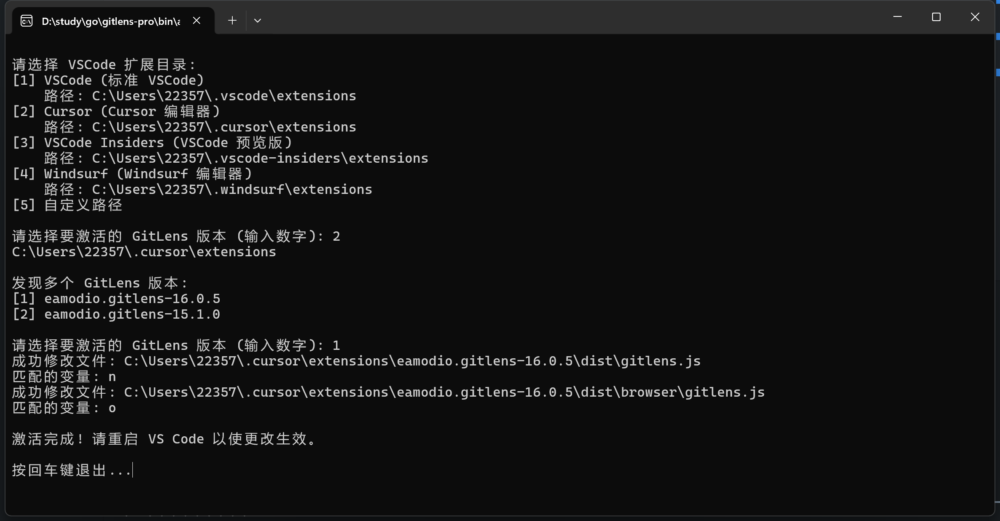
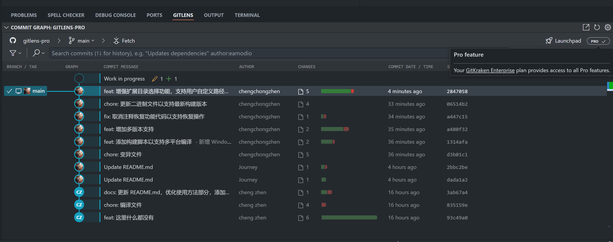

# GitLens Pro Activator

一个用于激活 GitLens Pro 的工具。

下载文件在 bin 目录下

## 要求

推荐使用 15.1.0 版本的 GitLens, 

必须登录, 这是必须的步骤, 注册随便用个邮箱就行, 不登陆没法触发

## 使用方法

运行之后会有相关提示，根据提示操作即可



效果



### Windows 用户

双击运行
```
activate.exe 
```

### macOS 用户

直接运行 `activate_mac` 即可。

```bash
chmod +x activate_mac_arm64 && ./activate_mac_arm64
```

### Linux 用户

直接运行 `activate` 即可。

```bash
./activate
```
